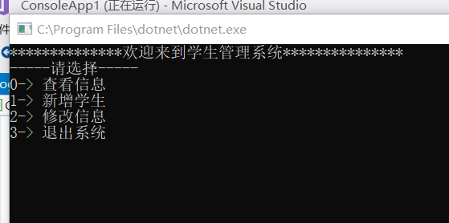

# 学生信息管理系统

学生信息管理系统可以录入学生的姓名，性别，年龄，出生日期以及成绩，并为他们安排学号，根据姓名以及学号更改信息。

## 1.使用方式
进入Visual Studio打开代码，运行程序出现如下界面

输入0,1,2,可分别进行信息查看，信息录入与信息修改，操作结束后输入3退出系统

## 2.未来版本预期

1.加入更多信息，并能够更加灵活地对信息进行修改  
2.加入学生查找功能，根据某一类信息查找学生  
3.制作便于使用的页面

## 3.作者
电气1703   左运扬  
U201711701

 